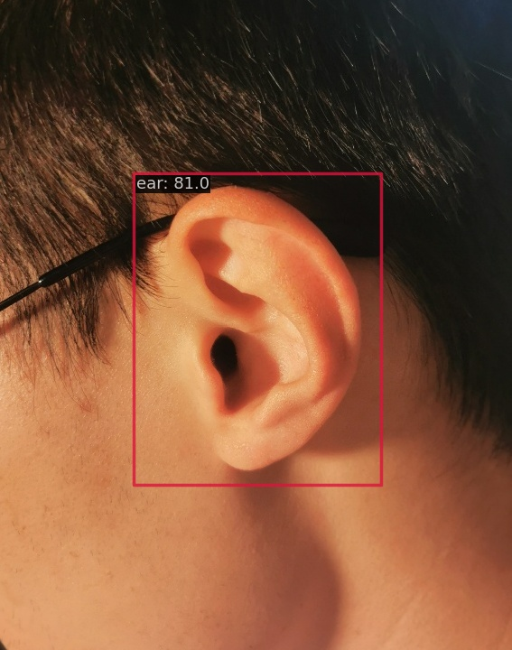
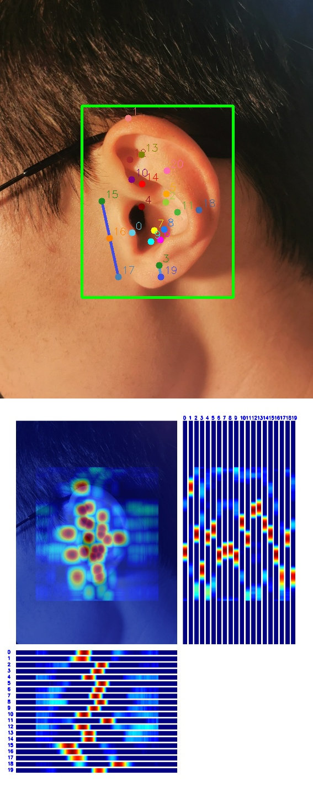

# 01_mmpose_assign

### directory tree
```
.
├── openmmlab_config	        # 训练相关的配置文件
│   ├── myEar0.jpg              # my ear
│   ├── myEar.jpg               # my ear 原图
│   ├── resize_.py              # 缩放原图尺寸
│   ├── rtmdet_tiny_ear.py      # RTMDet 配置文件
│   ├── rtmpose-s-ear.py        # RTMPose 配置文件
│   └── run.sh                  # 训练，测试，推理的shell脚本
├── README.md
├── RTMDet_tiny_ear             # RTMDet 训练测试推理相关文件
│   ├── inference               # RTMDet 预测结果
│   │   ├── preds
│   │   │   └── myEar0.json
│   │   └── vis
│   │       └── myEar0.jpg
│   ├── rtmdet_tiny_ear.py      
│   ├── test                    # RTMDet 测试日志
│   │   ├── 20230604_114753.json
│   │   ├── 20230604_114753.log
│   │   ├── result.txt          # 测试结果记录在result.txt
│   │   └── vis_data
│   │       └── config.py
│   └── train                   # RTMDet 训练日志
│       ├── 20230604_004321.log
│       └── vis_data
│           ├── 20230604_004321.json
│           ├── config.py
│           └── scalars.json
└── RTMPose_s_ear               # RTMPose 训练测试推理相关文件
    ├── epoch_300_result.txt    # 测试结果
    ├── inference               # 推理结果
    │   └── myEar0.jpg
    ├── rtmpose-s-ear.py
    ├── test_epoch300           # 测试日志
    │   ├── 20230604_000340.json
    │   ├── 20230604_000340.log
    │   └── vis_data
    │       └── config.py
    └── train                   # 训练日志
        ├── 20230603_200120.log
        └── vis_data
            ├── 20230603_200120.json
            ├── config.py
            └── scalars.json
15 directories, 28 files
```

## 目标检测模型（RTMDet-tiny）

### epoch165 result
```
 Average Precision  (AP) @[ IoU=0.50:0.95 | area=   all | maxDets=100 ] = 0.804
 Average Precision  (AP) @[ IoU=0.50      | area=   all | maxDets=100 ] = 0.967
 Average Precision  (AP) @[ IoU=0.75      | area=   all | maxDets=100 ] = 0.967
 Average Precision  (AP) @[ IoU=0.50:0.95 | area= small | maxDets=100 ] = -1.000
 Average Precision  (AP) @[ IoU=0.50:0.95 | area=medium | maxDets=100 ] = -1.000
 Average Precision  (AP) @[ IoU=0.50:0.95 | area= large | maxDets=100 ] = 0.804
 Average Recall     (AR) @[ IoU=0.50:0.95 | area=   all | maxDets=  1 ] = 0.836
 Average Recall     (AR) @[ IoU=0.50:0.95 | area=   all | maxDets= 10 ] = 0.836
 Average Recall     (AR) @[ IoU=0.50:0.95 | area=   all | maxDets=100 ] = 0.836
 Average Recall     (AR) @[ IoU=0.50:0.95 | area= small | maxDets=100 ] = -1.000
 Average Recall     (AR) @[ IoU=0.50:0.95 | area=medium | maxDets=100 ] = -1.000
 Average Recall     (AR) @[ IoU=0.50:0.95 | area= large | maxDets=100 ] = 0.836
06/04 11:48:04 - mmengine - INFO - bbox_mAP_copypaste: 0.804 0.967 0.967 -1.000 -1.000 0.804
06/04 11:48:04 - mmengine - INFO - Epoch(test) [11/11]    coco/bbox_mAP: 0.8040  coco/bbox_mAP_50: 0.9670  coco/bbox_mAP_75: 0.9670  coco/bbox_mAP_s: -1.0000  coco/bbox_mAP_m: -1.0000  coco/bbox_mAP_l: 0.8040  data_time: 0.3000  time: 0.4225
```
### Predict


## 关键点检测模型（RTMPose-s）

### epoch300 result
```
 Average Precision  (AP) @[ IoU=0.50:0.95 | area=   all | maxDets= 20 ] =  0.736
 Average Precision  (AP) @[ IoU=0.50      | area=   all | maxDets= 20 ] =  1.000
 Average Precision  (AP) @[ IoU=0.75      | area=   all | maxDets= 20 ] =  0.902
 Average Precision  (AP) @[ IoU=0.50:0.95 | area=medium | maxDets= 20 ] = -1.000
 Average Precision  (AP) @[ IoU=0.50:0.95 | area= large | maxDets= 20 ] =  0.736
 Average Recall     (AR) @[ IoU=0.50:0.95 | area=   all | maxDets= 20 ] =  0.764
 Average Recall     (AR) @[ IoU=0.50      | area=   all | maxDets= 20 ] =  1.000
 Average Recall     (AR) @[ IoU=0.75      | area=   all | maxDets= 20 ] =  0.929
 Average Recall     (AR) @[ IoU=0.50:0.95 | area=medium | maxDets= 20 ] = -1.000
 Average Recall     (AR) @[ IoU=0.50:0.95 | area= large | maxDets= 20 ] =  0.764
06/04 00:04:21 - mmengine - INFO - Evaluating PCKAccuracy (normalized by ``"bbox_size"``)...
06/04 00:04:21 - mmengine - INFO - Evaluating AUC...
06/04 00:04:21 - mmengine - INFO - Evaluating NME...
06/04 00:04:21 - mmengine - INFO - Epoch(test) [2/2]    coco/AP: 0.736280  coco/AP .5: 1.000000  coco/AP .75: 0.902223  coco/AP (M): -1.000000  coco/AP (L): 0.736280  coco/AR: 0.764286  coco/AR .5: 1.000000  coco/AR .75: 0.928571  coco/AR (M): -1.000000  coco/AR (L): 0.764286  PCK: 0.968254  AUC: 0.122052  NME: 0.041862  data_time: 3.992798  time: 4.789786
```

### Predict

