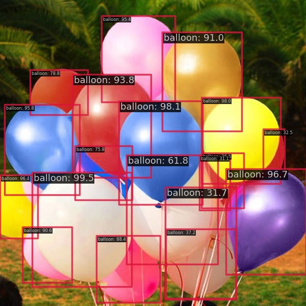
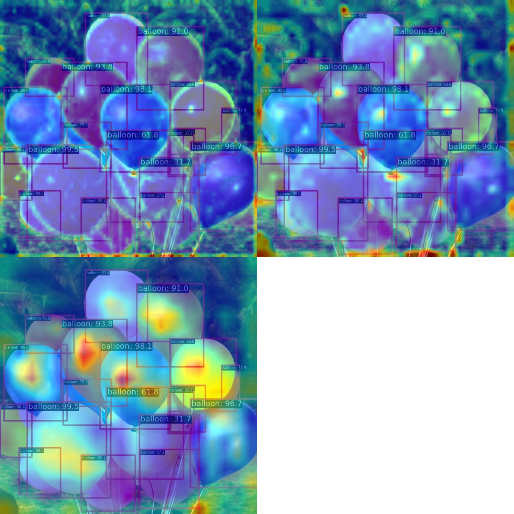

# 文件列表
```shell
.
├── feature_visualization
│   └── output
│       └── balloon.jpg
├── inference
│   ├── preds
│   │   └── balloon.json
│   └── vis
│       └── balloon.jpg
├── json2coco.py
├── README.md
├── run.sh
├── test_log
│   ├── 20230611_233910.json
│   ├── 20230611_233910.log
│   └── vis_data
│       └── config.py
├── train_log
│   ├── 20230611_232858.log
│   └── vis_data
│       ├── 20230611_232858.json
│       ├── config.py
│       └── scalars.json
└── zj_config.py
```
# 验证结果
```shell
2023/06/11 23:39:14 - mmengine - INFO - bbox_mAP_copypaste: 0.780 0.871 0.847 0.000 0.524 0.914
2023/06/11 23:39:14 - mmengine - INFO - Epoch(test) [13/13]    coco/bbox_mAP: 0.7800  coco/bbox_mAP_50: 0.8710  coco/bbox_mAP_75: 0.8470  coco/bbox_mAP_s: 0.0000  coco/bbox_mAP_m: 0.5240  coco/bbox_mAP_l: 0.9140  data_time: 0.0272  time: 0.1134
```
# 预测结果


# 特征可视化



